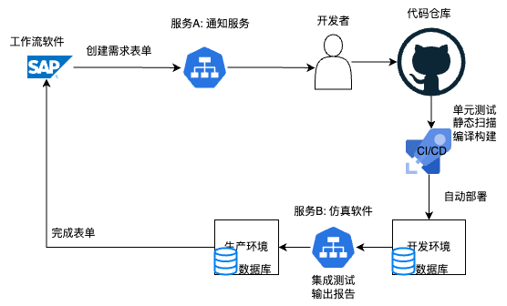
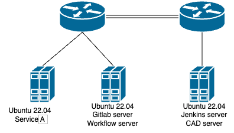

# 系统架构概况
## 业务系统架构图
请尽量详细的描述预期要达到的系统架构：
+ 各个服务的功能
+ 各服务的开发技术栈（python/java/C）
+ 工作流软件的选型
+ 代码仓库的选型
+ CI/CD 工具的选型（如已有）
+ 环境的数量（如开发，测试，预发布，生产）
+ 数据库选型
+ 上述各服务，组件及工作流之间互相触发调用的自动化流程关系
+ 标明哪些流程/组件是已有的，哪些是缺失的

如下是一个示例：


## 基础设施架构图
请描述现有基础设施的架构：
+ 服务器数量
+ 网络拓扑图
+ 各服务的安装位置（哪台服务器上）
+ 服务器的操作系统版本

如下是一个示例：

## 需求的文字描述
请基于上面的架构图尽量详细的描述需求，便于我们评估工作量
```


```

## 特别说明
**如有需要特别声明的内容，请在此段添加**
```


```